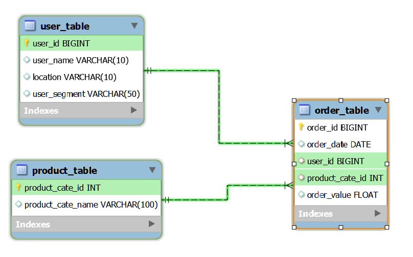

# Business Intelligence Season 6 - Round 1

## SQL challenge
> Tables

	
order_table

| order_id | order_date | user_id | product_cate_id | order_value |
| ---: | ---: | ---: | ---: | ---: |
| 150151 | 01/05/2021 | 101 | 1 | 150000 |
| 178151 | 06/05/2021 | 102 | 5 | 300000 |
| 178629 | 06/07/2021 | 101 | 2 | 250000 |
| 180053 | 01/07/2021 | 103 | 3 | 89000 |
| 184235 | 10/08/2021 | 102 | 5 | 50000 |
| 196325 | 27/05/2021 | 103 | 4 | 140000 |

 

	
product_table

| product_cate_id | product_cate_name |
| ---: | :--- |
| 1 | books |
| 2 | home_decor |
| 3 | ultilities |
| 4 | food |
| 5 | mom_and_baby |
| 6 | electronics |

 

	
user_table

| user_id | user_name | location | user_segment |
| ---: | :--- | :--- | :--- |
| 101 | A | HCM | Whale |
| 102 | B | HN | Salon |
| 103 | C | DN | Dolphin |
| 104 | D | HCM | Whale |
| 105 | E | HN | Dolphin |

### Question 1
> EER Diagram

	

 

### Question 2 - 7

| Question | Answer |
| :---: | :---: |
| 2 | [Link](answers/question_2.md) |
| 3 | [Link](answers/question_3.md) |
| 4 | [Link](answers/question_4.md) |
| 5 | [Link](answers/question_5.md) |
| 6 | [Link](answers/question_6.md) |
| 7 | [Link](answers/question_7.md) |